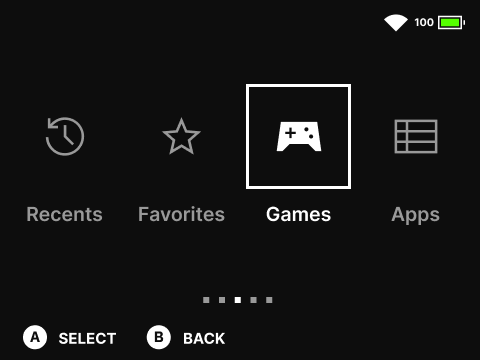

# `sharp` by `m_axic`

**A simplistic, sharp theme for [Onion OS](https://github.com/OnionUI/Onion).**

## Screenshots

  

---

---

## Credits

### Icons

- [Material Symbols](https://fonts.google.com/icons?icon.style=Sharp)
- OnionUI

### Fonts

- IBM Plex Mono
- IBM Plex Sans
